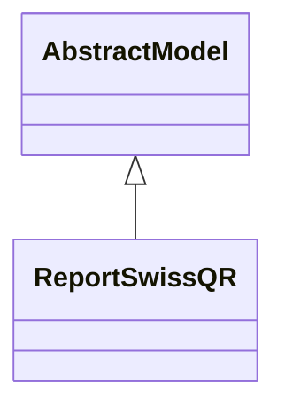

# Reports

Report definitions and templates in l10n_ch.

## Available Reports

### PDF/Document Reports
- **QR-bill** (PDF/Print)
- **QR-bill Header** (PDF/Print)
- **ISR** (PDF/Print)

## Report Files

- **__init__.py** (Python logic)
- **isr_report.xml** (XML template/definition)
- **swissqr_report.py** (Python logic)
- **swissqr_report.xml** (XML template/definition)

## Notes
- Named reports above are accessible through Odoo's reporting menu
- Python files define report logic and data processing
- XML files contain report templates, definitions, and formatting
- Reports are integrated with Odoo's printing and email systems
